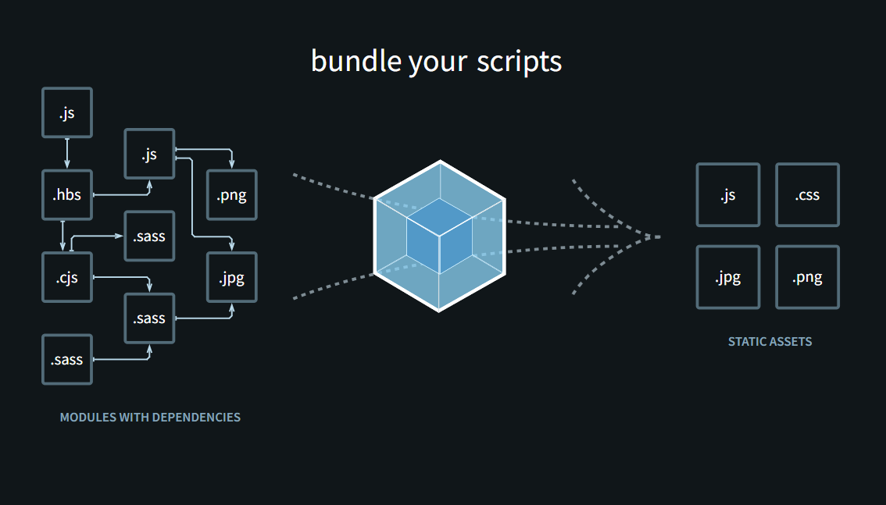

# 📦 Module Bundlers

> A comprehensive comparison and demonstration of popular JavaScript module bundlers including Webpack and Vite


This project provides hands-on examples and configurations for different module bundlers, showcasing their capabilities, performance characteristics, and use cases. Perfect for developers looking to understand bundler differences and choose the right tool for their projects.

---

## 📋 Table of Contents

- [📦 Module Bundlers](#-module-bundlers)
  - [📋 Table of Contents](#-table-of-contents)
  - [🛠️ Tech Stack](#️-tech-stack)
    - [Frontend](#frontend)
    - [Bundlers \& Build Tools](#bundlers--build-tools)
    - [Development Tools](#development-tools)
  - [✨ Key Features](#-key-features)
  - [🚀 Getting Started](#-getting-started)
    - [Prerequisites](#prerequisites)
    - [Installation](#installation)
    - [Configuration](#configuration)
    - [Running the Applications](#running-the-applications)
  - [📁 Project Structure](#-project-structure)
  - [📊 Bundler Comparison](#-bundler-comparison)
  - [🖼️ Screenshots](#️-screenshots)
  - [🤝 Contributing](#-contributing)
  - [📄 License](#-license)
  - [👤 Author](#-author)

---

## 🛠️ Tech Stack

### Frontend


### Bundlers & Build Tools


### Development Tools


---

## ✨ Key Features

- **🔧 Multiple Bundler Configurations**: Side-by-side comparison of Webpack and Vite setups
- **⚡ Performance Optimization**: Production and development builds with different optimization strategies
- **🔄 Hot Module Replacement**: Live reloading and fast refresh capabilities
- **📦 Asset Management**: Optimized handling of CSS, images, and other static assets
- **🎯 React Integration**: Modern React 19 setup with JSX support
- **🛡️ Source Maps**: Comprehensive debugging support in development mode
- **📱 Modern JavaScript**: ES6+ features with Babel transpilation
- **🎨 CSS Processing**: Advanced CSS handling with extraction and minification

---

## 🚀 Getting Started

### Prerequisites

Before running this project, ensure you have the following installed:

- **Node.js** (v16.0.0 or higher)
- **npm** (v7.0.0 or higher) or **yarn** (v1.22.0 or higher)

```bash
# Check your versions
node --version
npm --version
```

### Installation

1. **Clone the repository:**
   ```bash
   git clone https://github.com/K-stiles/module-bundlers.git
   cd module-bundlers
   ```

2. **Install Webpack bundler dependencies:**
   ```bash
   cd webpack-bundler
   npm install
   ```

3. **Install Vite bundler dependencies (when available):**
   ```bash
   cd ../vite-bundler
   npm install
   ```

### Configuration

Each bundler directory contains its own configuration files:

**Webpack Configuration:**
- `webpack.development.config.js` - Development build settings
- `webpack.production.config.js` - Production build settings
- `package.json` - Dependencies and scripts

**Environment Setup:**
No additional environment variables are required for basic functionality.

### Running the Applications

#### Webpack Bundler



**Development Mode:**
```bash
cd webpack-bundler
npm run devBuild

# Start development server (if configured)
npx webpack serve --config webpack.development.config.js
```

**Production Build:**
```bash
cd webpack-bundler
npm run prodBuild
```

**Serve Production Build:**
```bash
# Install a simple HTTP server if needed
npm install -g http-server

# Serve the dist directory
http-server dist/
```

#### Vite Bundler

```bash
cd vite-bundler
# Commands will be available once Vite configuration is complete
npm run dev      # Development server
npm run build    # Production build
npm run preview  # Preview production build
```

---

## 📁 Project Structure

```
module-bundlers/
├── README.md
├── webpack-bundler/
│   ├── package.json
│   ├── webpack.development.config.js
│   ├── webpack.production.config.js
│   ├── public/
│   │   └── index.html
│   └── src/
│       ├── app.css
│       ├── app.js
│       └── index.js
├── vite-bundler/
│   └── (Configuration in progress)
└── screenshots/
    ├── banner.png
    ├── webpack-build.png
    └── performance-comparison.png
```

---

## 📊 Bundler Comparison

| Feature | Webpack | Vite |
|---------|---------|------|
| **Build Speed** | Moderate | ⚡ Very Fast |
| **Dev Server** | webpack-dev-server | Built-in |
| **Hot Reload** | ✅ HMR | ✅ Fast Refresh |
| **Code Splitting** | ✅ Advanced | ✅ Automatic |
| **Plugin Ecosystem** | 🔥 Extensive | 📈 Growing |
| **Configuration** | Complex | Simple |
| **Production Optimization** | ✅ Comprehensive | ✅ Built-in |
| **Bundle Analysis** | ✅ webpack-bundle-analyzer | ✅ Built-in |

---

## 📄 License

This project is licensed under the **ISC License** - see the [LICENSE](LICENSE) file for details.

---

## 👤 Author

**Kwaku Stiles**

- GitHub: [@K-stiles](https://github.com/K-stiles)
- LinkedIn: [Connect with me](https://linkedin.com/in/micheal-essuman)

---

<div align="center">

**[⬆ Back to Top](#-module-bundlers)**

Made with ❤️ by [Kwaku Stiles](https://github.com/K-stiles)

</div>
